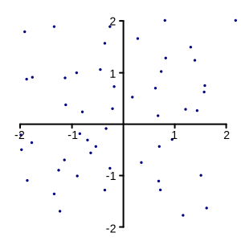
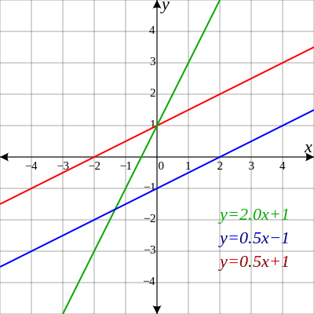

# Day 1

Attendees will learn to **think in models**. They gather insight on what spatial data is, how it is collected and how it relates to regular data. After this day, they will have good insight on how to model real-world objects as data.

 ### 1.1. Thinking in models
 A real-world object cannot be stored on a computer, we store "a representation of a real-world object that matches our requirements". What can such requirements be? Basically it is all about being useful. Models form the building blocks that help us make decisions, draw conclusions and get things done.

 ##### Excercise 1
 Imagine your company doing paint jobs. It is your job to go paint the interior walls of a building. What would you need to model? What do you need to store on a computer so you can calculate the ammount of paint required and the number of hours your workers are going to spend to paint all the walls?

 ##### Excercise 2
 You are a calculator with a road-construction company. What do you need to store on a computer so you can calculate how much asphalt is required? And how about the speed? What do you need to know to determine the maximum speed that can be driven on the road?

 ##### Exercise 4
 You own a public pool. What information do you need to store to attract visitors? And do you need other information from other parties?

 We now have some insight in what models are. You now know that often models with information about size, shape and location can greatly enhance the possibilities to use them.

 ### 1.2. Geometry primitives

 So you learned about walls, the shape of roads and location. Geometry is the branch of mathematics concerned with questions of shape, size, relative position of figures, and the properties of space. When we talk about this in general, we will from now on address this as __Geometry__. Geometry and geometric calculations require study. In this course the explaination of geometry will be limited to what is required to reach the goals of the training.

 #### 1.2.1. Points
 A point is a geometry primitive. A point can be modelled by an ordered pair (x,y) or (latitude,longitude) or triplet (x,y,z) or (latitude, longitude, height). There are more representations, for the purpose of this course, we will stick with (x,y) 2 dimensional coordinates. Feel free to get yourself informed about 3D after this course, it opens a whole new world of opportunities!

 In OpenStreetMap a point is called a _node_ [http://wiki.openstreetmap.org/wiki/Node]

 A point tells you something about location, but hardly about shape. So when we model a building as a point and want to use it to calculate a paint job, it will not do. Points alone hardly tell us anything. It is __relative position__ that makes it shine!
 

 ##### Exercise 5
 When we have a point in (latitude, longitude) that represents a restaurant and a point that represents our current position, what can we do with that?

 ##### Exercise 6
 When we have a point in (latitude, longitude) that represents an explosion and we have a lot of points that represent people, what can we do?

 #### 1.2.2. Lines
 Lines, we all know what they are. In mathematics, they are often defined as a function (vectors).
 
But in databases, they are most often a collection of points and that is often also how they are stored in the database. So lines are constructed out of points. Lines can also be connected. From lines we can calculate length. Lines also form the basics for navigation.

 In OpenStreetMap a line is called a _way_ [http://wiki.openstreetmap.org/wiki/Way]
 
 

 ##### Exercise 7
 Why are lines used for navigation and why is that better then using points?

 ##### Exercise 8
 We have a line representing a planned road and a line representing a river. These lines cross. What does this inform us about?

 #### 1.2.2. Polygons
 As you may have noticed by now, primitives are constructed from other primitives. Lines are constructed from points. A polygon is a closed shape. It is constructed from... correct!

 In Openstreetmap a polygon is a _way_, but this time the first and last point on the way need to be connected!
 [http://wiki.openstreetmap.org/wiki/Way]

 ##### Exercise 9
 We have a point representing our holiday location. We have a line representing the flight route for an airplane. We have a polygon representing a country at war.The line crosses the polygon. What should we do?

 #### 1.2.3. Advanced primitives
 You now know the basics of geometric primitives. Primitives are constructed from other primitives. As geometry is a mathematics branch, we can do all sort of operations with primitives that create other primitives. Here are a couple of examples.

 ##### Exercise 10

 Can you think of some real world example for the advanced primitives? Lets go through them.
