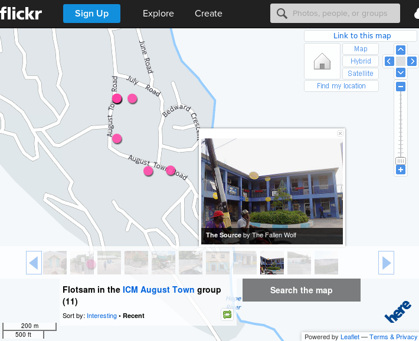

# Upload media

## Objective

Learn how to upload media and check if location information is used by the selected media website or application.

## Materials and equipment

- Computer with internet access.
- Data transfer cable for their smartphone or application for uploading installed on the smartphone.

----

The Interactive Online Experience can be greatly enhanced by using images and video. But we somehow need to set up a connection between the map and the media. For this we chose to use Flickr http://flickr.com

You should sign up to flickr and upload the images created on the field day. Some images will be automatically matched to a location because they have a GPS coordinate. Others might need to be manually adjusted or positions, but this can also easily be done from the Flickr website by dragging images to the right place on the map.

When the images are geolocated, you can use the Flickr __Map__ page to check if everything is in place. These images can then later be used by the developers who can integrate them in the Interactive Community Mapping Application.

