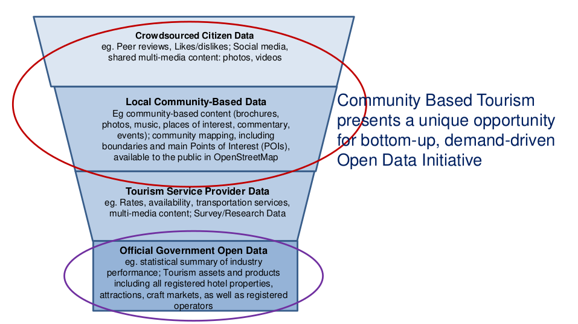

# Why?

There is a lot of economic value in geodata. See for example [this infographic by Oxera](http://www.oxera.com/Oxera/media/Oxera/images/Oxera-Geo-Services.jpg).

Often this value is in the hands of large corporations. We want to bring this power into our own hands.

